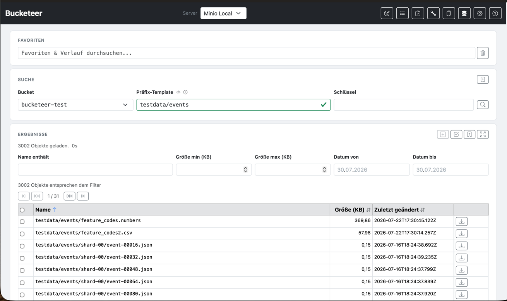

# Bucketeer

A web-based **S3 object browser** for any S3-compatible server — list, filter, sort, download, move, delete and compare objects in your browser.

## Features

- **Browse &amp; search** — paginated results, client-side filtering by name (regular expressions), size and last-modified date, sortable columns
- **Prefix templates** — build S3 prefixes dynamically with functions (`left`, `right`, `upper`, `lower`, `everyNth`, `substring`, `repeat`) and date placeholders; functions can be nested and combined with literal suffixes
- **Favorites &amp; history** — searchable combobox for favorites (server + bucket + prefix + key) and automatic search history
- **Selection &amp; bulk download** — collect objects across queries and download them all as a ZIP. **Note:** rendering the selection page inserts one row per selected object into the DOM. Very large selections (e.g. 100,000+ objects) take a while to render; the batch **Move Selected / Delete Selected** actions become active only once the list has finished loading. For very large datasets, keep the selection small (e.g. avoid "add all" for tens of thousands of objects).
- **Move &amp; delete objects** — move (same bucket, copy + delete) or delete individual objects from the results, or apply batch operations (delete / prefix-based move) to the selection; existing targets are skipped and reported
- **Action history** — every move/delete is recorded in `~/.bucketeer/actions/actions.jsonl` and can be reviewed on the **Action History** page (`/history`)
- **Snapshots** — save query results as Parquet, compare snapshots over time and export the diff (added / removed / changed objects)
- **Key Check** — upload a CSV with keys and verify which ones exist on the server
- **Text Tools** — Base64 / URL encode &amp; decode, timestamp ↔ date conversion, JSON pretty / minify, SHA-256
- **Dark mode** and German / English / Spanish UI
- **Zero-config security** — S3 credentials are encrypted at rest in `~/.bucketeer/servers.json`


---

## Running

```bash
mvn package
java -jar target/bucketeer-0.6.2.jar
```

Open [http://localhost:8080](http://localhost:8080).

### Configuration

S3 servers are configured at runtime via the **Configuration** page (`/config`).
Server credentials are stored encrypted in `~/.bucketeer/servers.json`.

### Encryption key

Bucketeer encrypts S3 credentials at rest. The encryption key is resolved in this order:

1. **Environment variable** `BUCKETEER_ENCRYPTION_KEY` – use this for production or shared deployments
2. **Key file** `~/.bucketeer/encryption.key` – auto-loaded if present
3. **Auto-generated** – on first run, a random 256-bit key is generated and saved to `~/.bucketeer/encryption.key`

The auto-generated key means zero configuration for personal use. For production, set the environment variable:

```bash
export BUCKETEER_ENCRYPTION_KEY=your-secret-key
java -jar target/bucketeer-0.6.2.jar
```

> **Warning:** if the key changes or is lost, existing credentials in `~/.bucketeer/servers.json` can no longer be decrypted. Re-enter server credentials via the Configuration page in that case.

---

## Generating test data

For performance and batch tests (deleting / moving large selections), Bucketeer can fill an S3-compatible server with deterministic test data — without the Spring context and without a web server:

```bash
java -jar target/bucketeer-0.6.2.jar --seed
```

Default structure (3000 objects, 1–10 KB, spread over 20 shard prefixes):

```
testdata/events/shard-00/event-000000.json
testdata/events/shard-01/event-000001.json
...
testdata/events/shard-19/event-002999.json
```

Spreading the objects across multiple prefixes improves the listing and batch performance of S3-compatible servers.

**Options** (all with defaults):

| Option | Default | Description |
|--------|---------|-------------|
| `--endpoint` | `http://localhost:9000` | S3 endpoint (MinIO container or NetApp) |
| `--access-key` / `--secret-key` | `admin` / `admin123` | Credentials |
| `--region` | `us-east-1` | AWS region |
| `--no-verify-ssl` | – | accept any certificate (e.g. StorageGRID without a valid certificate) |
| `--bucket` | `testdata` | Target bucket |
| `--count` | `3000` | Number of objects |
| `--prefixes` | `20` | Fan-out / number of shard prefixes |
| `--size-min` / `--size-max` | `1024` / `10240` | Object sizes in bytes |
| `--parallel` | `10` | Parallel upload threads |
| `--empty` | – | Fully empty the bucket beforehand |
| `--dry-run` | – | Only print the plan, write nothing |

**Examples:**

MinIO container (docker-compose):

```bash
java -jar target/bucketeer-0.6.2.jar --seed --endpoint=http://localhost:9000 \
  --access-key=admin --secret-key=admin123 --bucket=testdata --count=3000 --prefixes=20
```

NetApp StorageGRID (without a valid certificate):

```bash
java -jar target/bucketeer-0.6.2.jar --seed --endpoint=https://storagegrid:9000 \
  --access-key=AKIA... --secret-key=... --no-verify-ssl --bucket=testdata
```

Generation is **deterministic**: the same keys and sizes on every run. After delete/move tests, restore the original state manually by running the seed command again (optionally emptying the bucket first with `--empty`).

**Restore after a test** (empties the bucket and refills it):

```bash
java -jar target/bucketeer-0.6.2.jar --seed --empty --count=3000 --prefixes=20
```

**Show the plan without writing anything**:

```bash
java -jar target/bucketeer-0.6.2.jar --seed --dry-run
```

The `--seed` mode starts neither Spring nor the web server; it detects the flag at any argument position and exits with code `0` (success) or `1` (error).

---

## UI Features

### Dark Mode

Click the moon/sun icon in the navigation bar to toggle between light and dark mode.
The preference is saved in the browser and persists across sessions.

### Bucket Dropdown

The bucket selector is a dropdown populated from the configured S3 server.
Select a server first, then choose a bucket from the list.

### Favorites & History

**Favorites** save a named combination of **server + bucket + prefix template + key** for quick reuse.
They are stored in the browser's `localStorage` — no server-side state required.

**Search history** is maintained automatically. Every submitted search combination is saved and the most recent entries are shown in the combobox.

The combobox input at the top of the page searches both favorites and history as you type:
- Favorites are shown with a ★ icon and can be deleted via the × button in the dropdown
- History entries are shown with a ↻ icon and appear in order of last use
- Use the **trash icon** next to the input to clear the search history
- Click the **bookmark icon** in the search panel header to save the current search as a favorite

### Results Panel

- Click the maximize icon to expand the results panel to full width
- A resolved prefix popover shows the computed S3 path on hover

### Sorting

Click any column header (**Name**, **Size**, **Last Modified**) to sort the results.
Click the same header again to reverse the sort direction.

- The active sort column is indicated by an up/down arrow
- Sort state is preserved when navigating away and back (e.g. to Settings or Help)
- A new search resets sorting to the default (Name, ascending)

### Selection

The selection lets you collect objects across multiple searches and download them all at once as a ZIP file.

**Adding items:**
- Select individual rows with the checkboxes and click the **cart-plus** icon
- Or click the **cart-check** icon to add all currently filtered results

**Selection page (`/cart`):**
- Items are grouped into batches; each batch shows its server, bucket, prefix, object count and total size
- Tick the batch checkboxes and use **Move selected**, **Delete selected** or **Download as ZIP** – all batch actions operate on the **selected** batches only
- Move / delete / download are blocked when the selection spans **multiple servers or buckets** (a clear message is shown)
- **Clear selection** – removes all items

The selection persists across searches and page navigations within the same session.
Duplicate items (same server + bucket + key) are not added twice.

### Move & Delete Objects

Every object row in the results panel offers two actions next to the download button:
- **Move** (arrows icon) – opens a dialog to enter the target key in the same bucket. Move is implemented as S3 **copy + delete**: the source is only deleted after a successful copy. If an object already exists at the target, the move is **skipped and reported** instead of overwritten.
- **Delete** (trash icon) – permanently deletes the object after a confirmation dialog.

Both actions also work as **batch operations** on the selection page (`/cart`). Batch moves replace the **object's own folder** (everything up to the last `/`) with the target prefix: `data/shard-00/test1/file.odt` moved to `archive/` becomes `archive/file.odt`. Objects keep only their file name — files collected from subfolders are moved **flat** into the target prefix. You only enter the target prefix; the source folder is taken from each object's key.

> **Skip semantics:** Objects whose target key already exists are **not overwritten** — they are skipped and recorded as `SKIPPED` in the **Action History**. When you move many objects at once (e.g. hundreds), it is **your responsibility** to ensure target keys are unique; otherwise objects are skipped. Check the Action History (`/history`) to see exactly what was moved, skipped or failed.

Every action (successful, skipped or failed) is recorded in the **Action History**.

### Action History (`/history`)

Every move and delete is logged as an audit entry in `~/.bucketeer/actions/actions.jsonl` with timestamp, action (move/delete), origin (results/selection), server, bucket, source and target key, and status (moved/skipped/deleted/failed). Failed operations keep their error message. On the Action History page you can review the log, clear it, or download it as JSON.

---

## Prefix Templates

Prefixes may be entered literally to define a search. Bucketeer uses a **prefix template** to compute the S3 path before listing objects.
A template is a path string where segments (separated by `/`) can contain **function placeholders**.

### Syntax

```
segment1/{functionName(ref, arg1, arg2)}/segment3/
```

- A **literal** segment is used as-is: `myprefix`, `2024`, `ABCDEFGH`
- A **placeholder** is wrapped in `{ }`: `{everyNth(key, 0, 2)}`
- A placeholder can have a **literal suffix**: `{left(key, 3)}-test` → `hel-test`
- Use `\{` to include a literal `{` in the path

### References

Inside a function call, the first argument is a **reference**:

| Reference            | Meaning                                          |
|----------------------|--------------------------------------------------|
| `key`                | The key value entered by the user                |
| `bucket`             | The selected bucket name                         |
| `p1`, `p2`, ... `pN` | The value of segment N in the template (1-based) |

**Rules for `pN`:**
- A `pN` reference to a **literal** segment is always allowed, regardless of position
- A `pN` reference to a **function** segment is only allowed if N < current position (left-to-right resolution)

### Functions

| Function | Signature | Description                                               |
|----------|-----------|-----------------------------------------------------------|
| `everyNth(ref, start, step)` | 1 ref + 2 args | Characters at index start, start+step, start+2*step, …    |
| `left(ref, n)` | 1 ref + 1 arg | First `n` characters; truncates if shorter                |
| `right(ref, n)` | 1 ref + 1 arg | Last `n` characters; truncates if shorter                 |
| `substring(ref, start, len)` | 1 ref + 2 args | From `start` (0-based), length `len`; truncates if needed |
| `upper(ref)` | 1 ref | Uppercase                                                 |
| `lower(ref)` | 1 ref | Lowercase                                                 |
| `repeat(ref)` | 1 ref | Returns the reference value unchanged (identity)          |
| `date(pattern)` | no ref | Current date/time formatted with `pattern`                |
| `date(pattern, offset)` | no ref | Current date/time ± offset                                |

**Date patterns** use Java `DateTimeFormatter` syntax: `yyyy/MM/dd`, `yyyyMMdd`, `yyyy/MM`, etc.

**Date offsets:** `+1d` (days), `-2h` (hours), `+3w` (weeks), `-1M` (months), `+2y` (years)

### Wildcard

A `*` at the end of the **Key** field performs a prefix search:
- Key `ABCDE*` → lists all objects whose key starts with `ABCDE` under the resolved prefix
- Only trailing wildcards are supported (S3 native prefix listing)

### Function chaining

Functions can be nested — the result of the inner function becomes the input of the outer:

```
{outer(inner(ref, args), outerArgs)}
```

The inner function is fully resolved first, then its result is passed as the reference to the outer function.
Chaining is arbitrarily deep.

Examples:
```
{upper(everyNth(key, 0, 2))}        → everyNth result in uppercase
{lower(left(key, 5))}               → first 5 chars in lowercase
{left(everyNth(key, 0, 2), 4)}      → everyNth result, first 4 chars
{upper(everyNth(p3, 0, 2))}         → everyNth on a literal segment, uppercased
```

Note: `date` ignores its reference argument, so `{upper(date(yyyy/MM/dd))}` is valid
but the `upper` has no meaningful effect on a date string containing only digits and separators.

---

## Examples

### 1. Direct literal path
```
Template:  data/2024/01/ABCDEFGH/foo.json
Key:       (empty)
Result:    data/2024/01/ABCDEFGH/foo.json
```
Lists all objects under that exact path.

---

### 2. everyNth key pattern
```
Template:  myprefix/{everyNth(key, 0, 2)}/{key}/
Key:       MTIzLzQ1Ni83ODkvMDEy
Result:    myprefix/MILQN8OkME/MTIzLzQ1Ni83ODkvMDEy/
```
`everyNth(key, 0, 2)` takes every other character (index 0, 2, 4, …) of the key.
Sometimes used for even distribution across S3 prefixes to avoid hotspots.

---

### 3. Shortened key from a literal segment
```
Template:  myprefix/{everyNth(p3, 0, 2)}/ABCDEFGH/
Key:       (empty)
Result:    myprefix/ACEG/ABCDEFGH/
```
`p3` references the third segment (`ABCDEFGH`), a literal. No key input needed.

---

### 4. Multiple functions on the same literal
```
Template:  data/{left(p4, 4)}/{everyNth(p4, 0, 2)}/ABCDEFGH/
Key:       (empty)
Result:    data/ABCD/ACEG/ABCDEFGH/
```
Both `left` and `everyNth` reference the literal `ABCDEFGH` at position 4.

---

### 5. Function with literal suffix
```
Template:  testdata/events/shard-00/{left(p2, 5)}-test
Key:       (empty)
Result:    testdata/events/shard-00/event-test
```
`p2` references segment 2 (`events`). The function result `event` is followed by the literal suffix `-test`.

---

### 6. Function suffix with extension
```
Template:  files/{upper(key)}.json
Key:       report
Result:    files/REPORT.json
```

---

### 7. Date-based partitioning
```
Template:  logs/{date(yyyy/MM/dd)}/
Key:       (empty)
Result:    logs/2026/07/04/
```

```
Template:  reports/{date(yyyy/MM, -1M)}/summary/
Key:       (empty)
Result:    reports/2026/06/summary/
```

---

### 8. Combined date and key
```
Template:  data/{date(yyyy/MM/dd)}/{everyNth(key, 0, 2)}/{key}/
Key:       MTIzLzQ1Ni83ODkvMDEy
Result:    data/2026/07/04/MILQN8OkME/MTIzLzQ1Ni83ODkvMDEy/
```

---

### 9. Wildcard search
```
Template:  myprefix/{everyNth(key, 0, 2)}/
Key:       ABCD*
```
Lists all objects under `myprefix/<everyNth result>/` whose key starts with `ABCD`.

---

### 10. Bucket name in path
```
Template:  {upper(bucket)}/{date(yyyy/MM/dd)}/
Bucket:    my-bucket
Result:    MY-BUCKET/2026/07/23/
```

---

### 11. Repeat a segment
```
Template:  abc/{repeat(p4)}/ghi/jkl
p4:        jkl
Result:    abc/jkl/ghi/jkl
```
`repeat(p4)` copies the value of segment 4 into the current position.

---

### 12. Repeat key or bucket
```
Template:  {repeat(key)}/archive/
Key:       doc.pdf
Result:    doc.pdf/archive/
```
```
Template:  {repeat(bucket)}/data/
Bucket:    my-bucket
Result:    my-bucket/data/
```

---

## S3 Query and Result Filtering

When a search is started, Bucketeer fetches **all matching objects** from S3 by paginating through all result pages. The results are cached in an in-memory [DuckDB](https://duckdb.org/) database for the duration of the session.

Once loading is complete, the results can be filtered without additional S3 requests:

| Filter | Description |
|--------|-------------|
| **Name contains** | [Regular expression](https://duckdb.org/docs/stable/sql/functions/regular_expressions.html) match on the object key |
| **Size min / max (KB)** | Filter by object size in kilobytes |
| **Date from / to** | Filter by last-modified date |

Filters are applied instantly with a short debounce delay. Pagination (100 objects per page) is available for large result sets.

A progress indicator shows how many objects have been found while S3 pagination is still running.

---

## Snapshots

Snapshots save the complete result set of a query (all objects under the searched prefix) as a Parquet file with metadata. This allows comparing results over time to detect new, removed, or changed objects.

**Saving a snapshot:**
- Run a query, then click the **bookmark-plus** icon in the results title bar
- The snapshot is auto-named from the query parameters (e.g. `my-bucket / data/2024/*`)
- The snapshot stores all objects under the prefix (unfiltered)

**Snapshot list (navbar bookmarks icon → `/snapshots`):**
- Dedicated page listing all saved snapshots with server, bucket, prefix, date and object count
- **Compare selected** – select exactly two snapshots with checkboxes and click **Compare selected** to show a diff (added, removed, changed objects)
- Both snapshots must have the same server, bucket and prefix to be comparable
- **Open in file manager** – reveals the snapshot parquet file in the OS file manager
- **Delete** – removes a snapshot

**Diff export:**
- After comparing two snapshots, the diff can be downloaded as CSV

**Retention:**
- Snapshots are automatically cleaned up after a configurable number of days
- Default: 30 days, configurable in **Settings** (`/settings`)
- Retention is stored in `~/.bucketeer/settings.json`

**Search History:**
- The search history size can be configured in **Settings** (`/settings`)
- Default: 50 entries, configurable up to 500
- Set to 0 to disable history tracking
- The **Name contains** result filter keeps its own history (last 20 terms by default); its size is configured separately in **Settings** (`/settings`)

**Query Settings:**
- **Max objects per query** stops fetching after the given number of objects (`0` = unlimited)
- If the limit is reached, the status line shows an amber **"limit reached"** hint – not all objects were loaded

---

## Key Check

The Key Check page (`/keycheck`) verifies whether keys from a CSV file exist in S3.

**Usage:**
- Select a server (navbar) and bucket
- Upload a CSV file with one key per line
- Choose the delimiter (comma, semicolon, pipe, tab)
- Indicate whether the CSV has a header row
- Click **Check** to run HEAD requests against S3

**Results:**
- Table shows each key with status (exists / missing), size, last modified, and ETag
- Summary badges: count of existing and missing keys
- Export results as CSV with the same delimiter and header format as the input

**Export format:**
```
key,exists,size_bytes,last_modified,etag
data/file1.parquet,true,12345,2026-07-22T10:00:00Z,"abc123"
data/file2.parquet,false,,,
```

---

## Text Tools

The Tools modal (wrench icon in the navbar) provides quick encoding, decoding and hashing operations.

**Supported operations:**

| Button | Action |
|--------|--------|
| **Base64 Encode** | Encodes text to Base64 |
| **Base64 Decode** | Decodes Base64 to text |
| **URL Encode** | Encodes text to URL-safe format |
| **URL Decode** | Decodes URL-encoded text |
| **Timestamp (ms) → Date** | Converts Unix timestamps (milliseconds) to local time, format `yyyy-MM-dd HH:mm:ss.SSS` |
| **Date → Timestamp (ms)** | Converts `yyyy-MM-dd HH:mm:ss[.SSS]` (local time) to a Unix timestamp in milliseconds |
| **JSON Pretty** | Formats/indents JSON input |
| **JSON Minify** | Compacts JSON into a single line |
| **SHA-256** | Computes the SHA-256 hex digest |

**Multi-line input:** Each line is processed independently. Results are joined with newlines, so you can encode/decode/hash multiple values at once. Timestamp conversion accepts optional milliseconds (`.SSS`); values without them are treated as `000`. JSON operations process the whole input (e.g. a pretty-printed multi-line JSON).

---

## S3 Server Configuration

S3 servers are managed at runtime via the **Configuration** page (`/config`). No restart is required after adding, editing or deleting a server.

Each server entry supports:

| Field | Description |
|-------|-------------|
| **Name** | Display name used in the server dropdown |
| **Endpoint** | S3-compatible endpoint URL, e.g. `http://localhost:9000` |
| **Region** | AWS region string, e.g. `us-east-1` (required but ignored by most S3-compatible servers) |
| **Access Key** | S3 access key |
| **Secret Key** | S3 secret key |
| **Verify Certificate** | Uncheck for HTTPS servers without a valid certificate (e.g. StorageGRID without cert) |
| **Timeout (seconds)** | Explicit API-call timeout for S3 requests. `0` = SDK default (no explicit timeout) |
| **Retries** | Number of retries for transient S3 errors. `0` = no retries (default 3) |

After saving, a **Save & Test** option verifies the connection by listing buckets before confirming.

Server credentials are stored encrypted in `~/.bucketeer/servers.json`.

---

## Adding a new function

1. Create a class implementing `TemplateFunction` in `domain/template/function/`
2. Annotate with `@Component`
3. Implement `name()`, `expectedArgCount()`, and `apply(resolvedRef, args)`

Spring auto-discovers all `TemplateFunction` beans — no registration needed.

```java
@Component
public class Md5Function implements TemplateFunction {

    @Override public String name() { return "md5"; }
    @Override public int expectedArgCount() { return 0; }

    @Override
    public String apply(String resolvedRef, List<String> args) {
        // compute MD5 of resolvedRef
    }
}
```

Usage in template: `data/{md5(key)}/{key}/`

## Miscellaneous

Some keys are Easter eggs.

Manche Schlüssel sind Ostereier.

Algunas claves son huevos de pascua.

## Last update
last update uwe.geercken@web.de - 2026-08-07