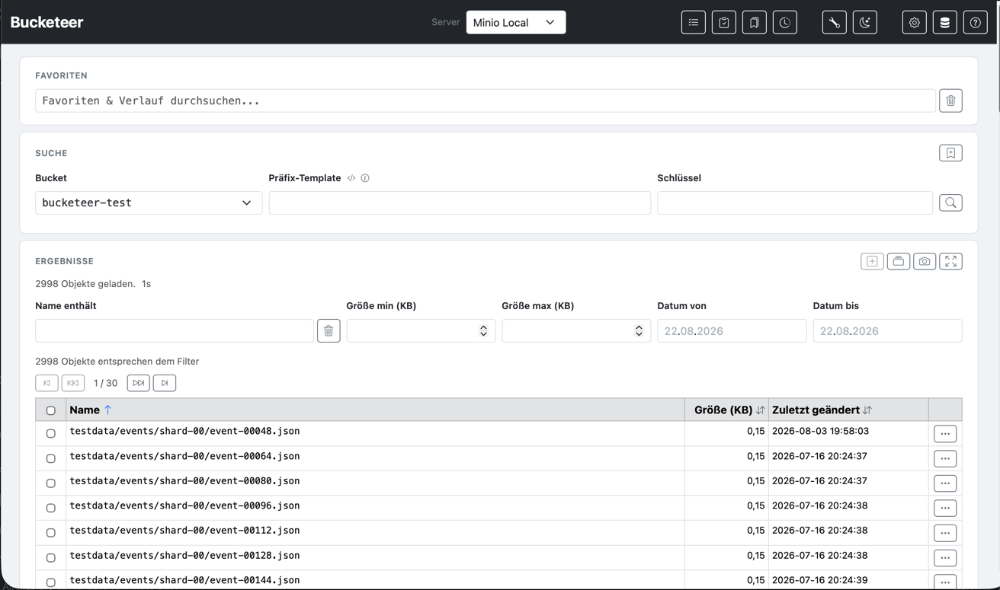

# Bucketeer

A web-based **S3 object browser** for any S3-compatible server — list, filter, sort, download, move, delete, upload and compare objects in your browser.



## Features

- **Browse &amp; search** — paginated results, client-side filtering by name (regular expressions), size and last-modified date, sortable columns
- **Prefix templates** — build S3 prefixes dynamically with functions and date placeholders; functions can be nested and combined with literal suffixes
- **Favorites &amp; history** — searchable combobox for favorites (server + bucket + prefix + key) and automatic search history
- **Selection &amp; bulk download** — collect objects across queries as batches and download them all as a ZIP
- **Move &amp; delete objects** — single and batch operations (copy + delete); existing targets are skipped and reported
- **File upload** — upload single or multiple files to any configured server and bucket, with an optional target prefix
- **Object tags** — view S3 tags of any object via the row context menu
- **Action history** — every move/delete/upload is recorded and can be reviewed on the **Action History** page
- **Snapshots** — save query results as Parquet, compare snapshots over time, export the diff, and load a saved snapshot back into the results table (filterable, no S3 scan)
- **Key Check** — upload a CSV with keys and verify which ones exist on the server
- **Text Tools** — Base64 / URL encode &amp; decode, timestamp ↔ date conversion, JSON pretty / minify, SHA-256
- **Zero-config security** — S3 credentials encrypted at rest
- **Built on Spring Boot 4** (Java 21, Jackson 3)
- **UI Languages** German / English / Spanish
- **Dark mode**

## Quick start

```bash
mvn package
java -jar target/bucketeer-0.7.8.jar
```

Open [http://localhost:8080](http://localhost:8080).

Default port is 8080 — change it without recompiling with `--server.port=9000` (or the `SERVER_PORT` environment variable). Use the [Docker/Podman](https://github.com/uwegeercken/bucketeer/wiki/Getting-Started) images for containerized deployments.

## Documentation

The full documentation lives in the [GitHub Wiki](https://github.com/uwegeercken/bucketeer/wiki).

- [Getting Started](https://github.com/uwegeercken/bucketeer/wiki/Getting-Started) — run the app (jar, Docker/Podman), custom port, test data, encryption key
- [Configuration](https://github.com/uwegeercken/bucketeer/wiki/Configuration) — application settings
- [S3 Server Configuration](https://github.com/uwegeercken/bucketeer/wiki/S3-Server-Configuration) — add, edit and test S3 servers
- [UI & Features](https://github.com/uwegeercken/bucketeer/wiki/UI-and-Features) — dark mode, upload, favorites & history, selection, move & delete, object tags, action history
- [Prefix Templates](https://github.com/uwegeercken/bucketeer/wiki/Prefix-Templates) — syntax, references, functions, wildcard and chaining
- [Prefix Template Examples](https://github.com/uwegeercken/bucketeer/wiki/Prefix-Template-Examples) — 12 worked examples
- [Query & Filtering](https://github.com/uwegeercken/bucketeer/wiki/Query-and-Filtering) — how searches and filters work
- [Snapshots](https://github.com/uwegeercken/bucketeer/wiki/Snapshots) — save, compare, clean up, and load snapshots back into the results
- [Key Check](https://github.com/uwegeercken/bucketeer/wiki/Key-Check) — verify keys from a CSV against S3
- [Text Tools](https://github.com/uwegeercken/bucketeer/wiki/Text-Tools) — encoding, timestamp and hashing utilities
- [Development](https://github.com/uwegeercken/bucketeer/wiki/Development) — brief notes on extending the app

## License

Bucketeer is available on [GitHub](https://github.com/uwegeercken/bucketeer).
