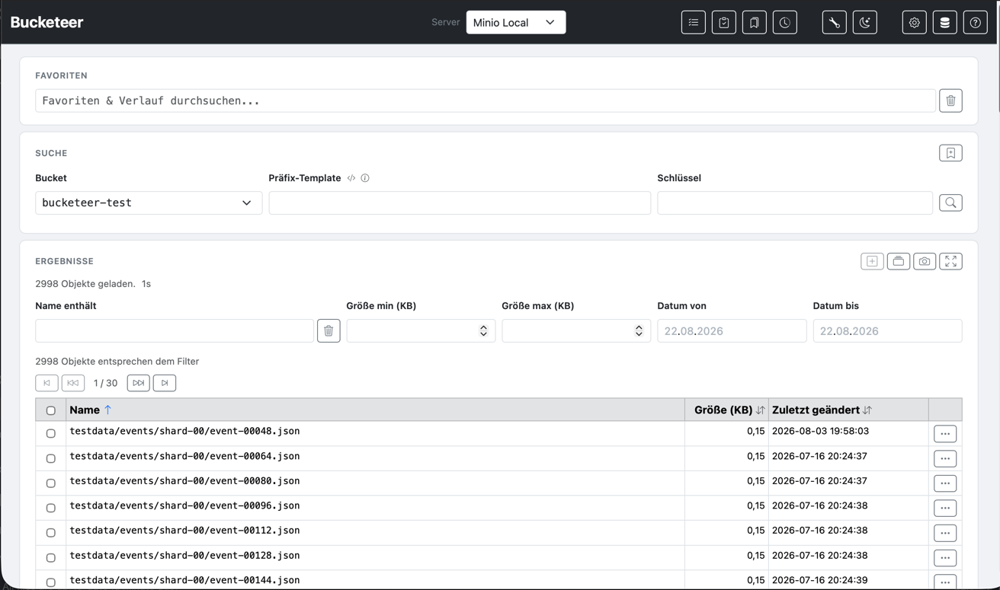

# Bucketeer

A web-based **S3 object browser** for any S3-compatible server — list, filter, sort, download, move, delete, upload and compare objects in your browser.



## Features

- **Browse &amp; search** — paginated results, client-side filtering by name (regular expressions), size and last-modified date, sortable columns
- **Prefix templates** — build S3 prefixes dynamically with functions and date placeholders; functions can be nested and combined with literal suffixes
- **Bucket prefix scan** — explore the common prefixes of any bucket level by level (breadcrumb with sub-prefix counts, load-more pagination), filter the list client-side, and adopt any prefix into the search field; limits configurable on the Settings page
- **Fast search** — every listing (search, download, snapshot, REST list) picks its strategy per query: a quick prefix analysis chooses between a sequential flat stream and a parallel per-prefix harvest (worker threads), so large sub-prefixes are fetched concurrently while many tiny prefixes stay on one stream — see [Parallel Listing](https://github.com/uwegeercken/bucketeer/wiki/Parallel-Listing)
- **Settings dialog** — all configuration (Query, History, Snapshots, Timezone, Upload, Scan) is grouped into blocks and opened from the gear icon on any page
- **Favorites &amp; history** — searchable combobox for favorites (server + bucket + prefix + key) and automatic search history
- **Selection &amp; bulk download** — collect objects across queries as batches and download them all as a ZIP
- **Move &amp; delete objects** — single and batch operations (copy + delete); existing targets are skipped and reported
- **File upload** — upload single or multiple files to any configured server and bucket, with an optional target prefix
- **Object tags** — view S3 tags of any object via the row context menu
- **Action history** — every move/delete/upload is recorded and can be reviewed on the **Action History** page
- **Snapshots** — save query results as Parquet, compare snapshots over time, export the diff, and load a saved snapshot back into the results table (filterable, no S3 scan)
- **Key Check** — upload a CSV with keys and verify which ones exist on the server
- **Text Tools** — Base64 / URL encode &amp; decode, timestamp ↔ date conversion, JSON pretty / minify, SHA-256
- **Zero-config security** — S3 credentials encrypted at rest
- **Built on Spring Boot 4** (Java 21, Jackson 3)
- **UI Languages** German / English / Spanish
- **Dark mode**

## Quick start

```bash
mvn package
java -jar target/bucketeer-0.9.1.jar
```

Open [http://localhost:8444](http://localhost:8444).

Default port is 8444 — change it without recompiling with `--server.port=9000` (or the `SERVER_PORT` environment variable). Every property of `application.yml` can be set the same way; the complete list is in [Environment Variables](https://github.com/uwegeercken/bucketeer/wiki/Environment-Variables). Use the [Docker/Podman](https://github.com/uwegeercken/bucketeer/wiki/Getting-Started) images for containerized deployments.

## Documentation

The full documentation lives in the [GitHub Wiki](https://github.com/uwegeercken/bucketeer/wiki).

- [Getting Started](https://github.com/uwegeercken/bucketeer/wiki/Getting-Started) — run the app (jar, Docker/Podman), custom port, test data, encryption key
- [Environment Variables](https://github.com/uwegeercken/bucketeer/wiki/Environment-Variables) — variables for the jar and the container image, with defaults and precedence
- [Configuration](https://github.com/uwegeercken/bucketeer/wiki/Configuration) — application settings
- [S3 Server Configuration](https://github.com/uwegeercken/bucketeer/wiki/S3-Server-Configuration) — add, edit and test S3 servers
- [UI & Features](https://github.com/uwegeercken/bucketeer/wiki/UI-and-Features) — dark mode, upload, favorites & history, selection, move & delete, object tags, action history
- [Prefix Templates](https://github.com/uwegeercken/bucketeer/wiki/Prefix-Templates) — syntax, references, functions, wildcard and chaining
- [Prefix Template Examples](https://github.com/uwegeercken/bucketeer/wiki/Prefix-Template-Examples) — 12 worked examples
- [Query & Filtering](https://github.com/uwegeercken/bucketeer/wiki/Query-and-Filtering) — how searches and filters work
- [Parallel Listing](https://github.com/uwegeercken/bucketeer/wiki/Parallel-Listing) — per-query strategy decision, prefix sampling, worker pool and configuration
- [Snapshots](https://github.com/uwegeercken/bucketeer/wiki/Snapshots) — save, compare, clean up, and load snapshots back into the results
- [REST API](https://github.com/uwegeercken/bucketeer/wiki/REST-API) — read-only terminal/scripting API under `/api/v1/`
- [Key Check](https://github.com/uwegeercken/bucketeer/wiki/Key-Check) — verify keys from a CSV against S3
- [Text Tools](https://github.com/uwegeercken/bucketeer/wiki/Text-Tools) — encoding, timestamp and hashing utilities
- [Development](https://github.com/uwegeercken/bucketeer/wiki/Development) — brief notes on extending the app

## REST API for the terminal

Bucketeer exposes a read-only, stateless API under `/api/v1/` for scripting — see the [REST API wiki page](https://github.com/uwegeercken/bucketeer/wiki/REST-API) for all endpoints and examples.

```bash
curl "http://localhost:8444/api/v1/buckets?server=Minio%20Local"
curl -o file.txt "http://localhost:8444/api/v1/download?server=Minio%20Local&bucket=my-bucket&key=data/2026/photo.jpg"
curl -o all.zip "http://localhost:8444/api/v1/download/prefix?server=Minio%20Local&bucket=my-bucket&prefix=testdata/events/"
```

To require a token on all `/api/v1/**` requests, start with `--bucketeer.api-token=<token>` (or set `BUCKETEER_API_TOKEN`) and send `Authorization: Bearer <token>`. Without a configured token the API stays open, like the rest of the app.

## DuckDB-Quack (remote SQL access)

Optional: let a **second DuckDB process** (e.g. the DuckDB CLI in a terminal) query the in-memory cache of the last search over the [Quack](https://duckdb.org/docs/stable/quack/overview) protocol — no export needed.

```bash
# 1. Enable it in the Settings dialog → section "DuckDB" (stored in ~/.bucketeer/settings.json).
# 2. Restart or toggle the setting; the server log prints the connection URI and token, e.g.:
#    DuckDB Quack server listening on quack:localhost:9494 (token: 64a2...).
# 3. Connect from any other DuckDB process:
duckdb <<'EOF'
LOAD quack;
ATTACH 'quack:localhost:9494' AS bucketeer (TOKEN '64a2...');
SELECT count(*) FROM bucketeer.objects;
EOF
```

The server only ever binds **localhost** (`allow_other_hostname` is never set) and requires the token from the log — use the exact host string `quack:localhost:<port>` on both sides. Port (default `9494`) and a fixed token can be set via `bucketeer.duckdb.quack.port` / `bucketeer.duckdb.quack.token` in `application.yml`; an empty token is generated randomly at start. Quack is a **beta** protocol — Bucketeer pins the DuckDB JDBC version in `pom.xml` to absorb API changes. If a Quack client drops the in-memory `objects` table, Bucketeer detects it on the next access, logs an error and recreates the empty table — the cache refills with the next search.

## Parallel listing

Search, download, snapshot and REST-list operations decide per query between a **sequential** flat listing stream and a **parallel** harvest that lists every top-level prefix on its own worker thread. The choice is made from a small random sample of the prefixes (default 8, `querySampleSize` in the Settings dialog) and an estimate of the S3 round trips: splitting pays off only when a sub-prefix holds roughly `1000 / workers` objects or more, so thousands of tiny prefixes stay on one cheap stream while large sub-prefixes are fetched concurrently. Workers run on a dedicated per-search pool, so the configured parallelism is honoured exactly, and a failed analysis falls back to sequential listing. The result set is identical either way — only the speed differs. After a search, an **info icon** in the results header opens the *Listing report* for that query: server, bucket, resolved prefix, worker count, strategy (sequential/parallel) and why it was chosen, plus the measured median per prefix when an analysis ran — with no extra S3 requests. Full decision model, sampling cache and settings: [Parallel Listing (Wiki)](https://github.com/uwegeercken/bucketeer/wiki/Parallel-Listing).

## License

Bucketeer is available on [GitHub](https://github.com/uwegeercken/bucketeer).
